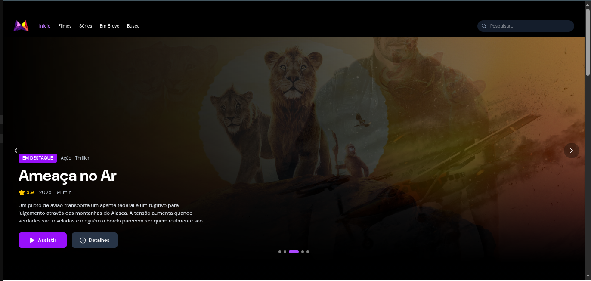
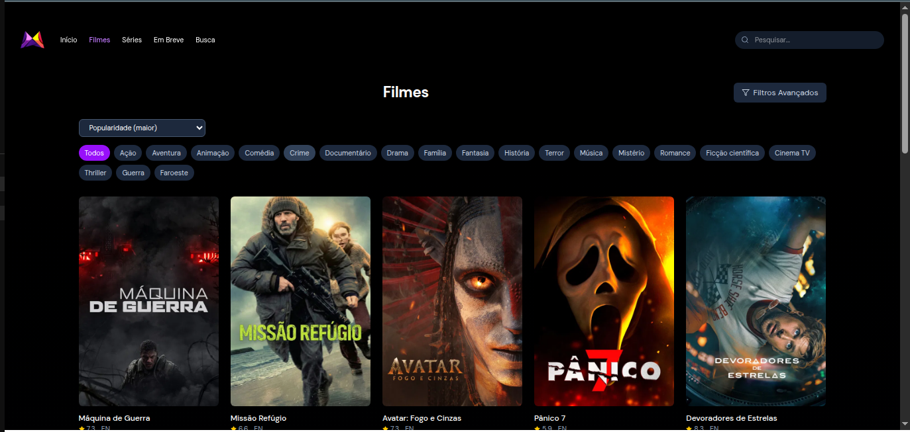
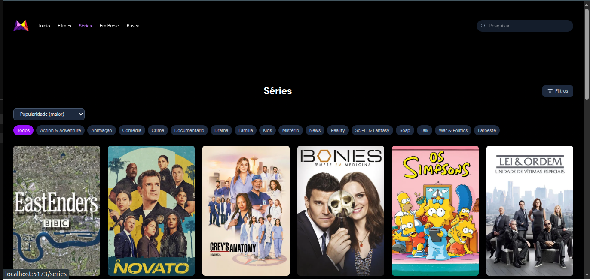
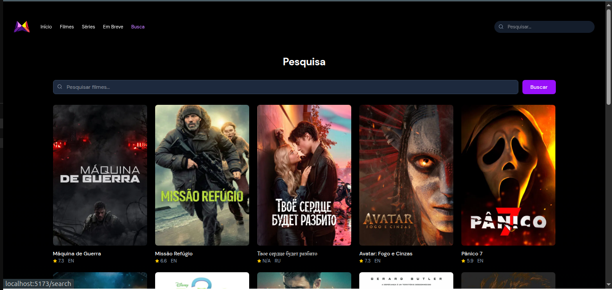
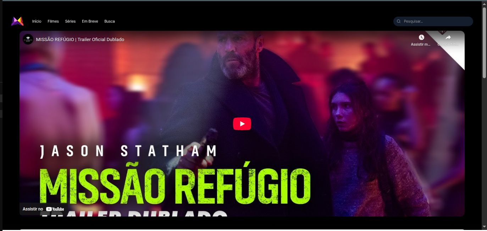

# Movie App

Aplicação web para descobriu e navegação de filmes e séries, utilizando a API do TMDB (The Movie Database). Permite explorar filmes populares, séries de TV, próximos lançamentos, busca de títulos e gerenciamento de watchlist.

## Funcionalidades

- **Home**: Exibe filmes em destaque, tendência do dia/semana e carrosséis de categorias
- **Filmes**: Lista de filmes com filtros por gênero, ordenação e paginação
- **Séries**: Lista de séries de TV com filtros por gênero, status, tipo e ordenação
- **Próximos Lançamentos**: Filmes que serão lançados em breve
- **Busca**: Pesquisa de filmes e séries por título
- **Detalhes**: Informações completas sobre títulos (sinopse, elenco, vídeos, notas)
- **Player**: Reprodução de trailers e vídeos de prévia
- **Watchlist**: Lista pessoal de títulos salvos (usando Appwrite)
- **Interface responsiva**: Adaptada para desktop e dispositivos móveis

## Tecnologias

- **React 18** - Biblioteca principal
- **TypeScript** - Tipagem estática
- **Vite** - Build tool e servidor de desenvolvimento
- **React Router v7** - Roteamento
- **TanStack Query** - Gerenciamento de estado e cache de requisições
- **TailwindCSS v4** - Estilização
- **Appwrite** - Backend para persistência da watchlist
- **TMDB API** - Fonte de dados de filmes e séries
- **Embla Carousel** - Carrosséis de navegação
- **React Player** - Reprodução de vídeos
- **Lucide React** - Ícones
- **Sonner** - Notificações toast

## Capturas de Tela











## Pré-requisitos

- Node.js 18+
- NPM ou PNPM
- Conta no [TMDB](https://www.themoviedb.org/) com API key
- (Opcional) Conta no [Appwrite](https://appwrite.io/) para watchlist

## Configuração

1. Clone o repositório:
```bash
git clone <url-do-repositorio>
cd movie-app
```

2. Instale as dependências:
```bash
npm install
# ou
pnpm install
```

3. Configure as variáveis de ambiente:
```bash
cp .env.example .env
```

4. Edite o arquivo `.env` com suas credenciais:

```env
# TMDB API (obrigatório)
VITE_TMDB_API_KEY=sua_chave_api_tmdb
VITE_API_BASE_URL=https://api.themoviedb.org/3

# Appwrite (opcional - para watchlist)
VITE_APPWRITE_PROJECT_ID=seu_project_id
VITE_APPWRITE_DATABASE_ID=seu_database_id
VITE_APPWRITE_COLLECTION_ID=sua_collection_id
```

### Obtendo a API Key do TMDB

1. Acesse [themoviedb.org](https://www.themoviedb.org/)
2. Crie uma conta ou faça login
3. Vá em **Settings** > **API**
4. Gere uma nova API key
5. Copie a chave para `VITE_TMDB_API_KEY`

### Configurando o Appwrite (opcional)

Para ativar a funcionalidade de watchlist:

1. Crie um projeto no [Appwrite](https://appwrite.io/)
2. Crie um banco de dados com os seguintes campos:
   - `userId` (string) - ID do usuário
   - `mediaId` (integer) - ID do filme/série
   - `mediaType` (string) - "movie" ou "tv"
   - `title` (string) - Título
   - `posterPath` (string) - Caminho do poster
   - `createdAt` (datetime) - Data de adição
3. Adicione os IDs nas variáveis de ambiente

## Executando o Projeto

### Desenvolvimento
```bash
npm run dev
```
A aplicação estará disponível em `http://localhost:5173`

### Build para Produção
```bash
npm run build
```

### Preview do Build
```bash
npm run preview
```

## Scripts Disponíveis

| Script | Descrição |
|--------|-----------|
| `npm run dev` | Inicia servidor de desenvolvimento |
| `npm run build` | Gera build de produção |
| `npm run preview` | Preview do build de produção |
| `npm run lint` | Executa linter ESLint |

## Estrutura do Projeto

```
src/
├── api/           # Configuração do cliente Axios
├── components/    # Componentes reutilizáveis
│   ├── dialog/    # Modais de detalhes e tendências
│   ├── movie-card/
│   ├── nav.tsx   # Navegação principal
│   └── ...
├── constants/     # Constantes (rotas, opções de filtro)
├── hooks/        # Custom hooks
├── lib/          # Utilitários (Appwrite, query client)
├── pages/        # Páginas/Rotas da aplicação
│   ├── home/
│   ├── movies/
│   ├── series/
│   ├── search/
│   ├── upcoming/
│   └── watch/
├── provider/     # Context providers
├── queries/      # Hooks do TanStack Query
├── services/     # Serviços de API (filmes, séries)
└── types/        # Definições TypeScript
```

## API Reference

Este projeto utiliza a [TMDB API v3](https://developer.themoviedb.org/docs/getting-started). Endpoints principais:

- `/movie/popular` - Filmes populares
- `/movie/upcoming` - Próximos lançamentos
- `/movie/now_playing` - Em cartaz
- `/trending/movie/{time_window}` - Tendências
- `/tv/popular` - Séries populares
- `/search/multi` - Busca multitype
- `/discover/movie` - Descobrir com filtros
- `/discover/tv` - Descobrir séries com filtros

## Licença

MIT
